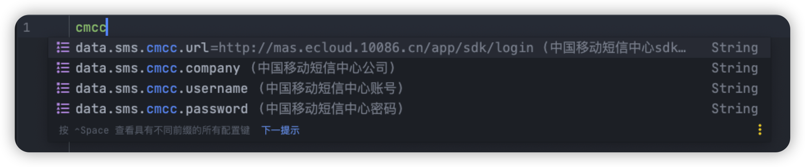

# data-cmcc-sms-spring-boot-starter

最新版本 [](https://jitpack.io/#datachina/data-cmcc-sms-spring-boot-starter)

支持的 SDK ：
- [x] [中国移动 Mas 短信SDK 0.0.1](.)

其他 SDK

- [x] [阿里云 SDK](https://github.com/datachina/data-sms-spring-boot-starter)
- [x] [腾讯云 SDK](https://github.com/datachina/data-sms-spring-boot-starter)


> 说明: 由于中国移动短信 sdk 的特殊性。遂将这个 sdk 进行单独封装。当然不排除后期合并的可能性。
> 
> 阿里云和腾讯云的短信 sdk 已被共同封装。详见 [data-sms-spring-boot-starter](https://github.com/datachina/data-sms-spring-boot-starter)

---

## 基本介绍

1. 为什么要有这个项目？

我们的项目基本都有发短信的需求，比如短信验证码登陆、发送告警短信、发送广告推送。
我们每次都要将 SDK 引入项目，然后经过一番配置才能使用。
所以我将常见的短信提供方的 SDK 做了简单封装，只需简单配置即可使用第三方的短信功能。

2. 为什么使用这个 starter？

使用这个 starter 只需要在短信服务供应商处创建好应用。经过简单配置即可使用短信功能。
对于独特需求自己也可以使用短信方 sdk 提供的能力。

3. 如何使用？

引入依赖，简单配置，注入短信服务商的 client 或 utils 即可使用最基本的短信功能。

复杂功能，则可以参考服务商 sdk 文档实现。

4. 特点

简单易用

5. 欢迎大家提出建议和意见

---

## 安装

### 1. 在 pom.xml 中加入 jitpack 的仓库

#### maven
```xml
<repositories>
    <repository>
        <id>jitpack.io</id>
        <url>https://jitpack.io</url>
    </repository>
</repositories>
```
#### gradle
```gradle
allprojects {
    repositories {
        maven { url 'https://jitpack.io' }
    }
}
```

> **注意:** 如果导入不了依赖,请检查自己的 maven 代理仓库(比如阿里云仓库)的 mirrorOf 标签的值是否为 *
>
> 请将其改为`<mirrorOf>*,!jitpack.io</mirrorOf>`即可
> 
> 详见 [解决引入第三方Repositories不生效问题](http://jdjy.esalotto.cn/blog/post/db9dd89c.html)

### 2. 添加依赖(查看徽标确定最新版)

#### maven
```xml
<dependency>
    <groupId>com.github.datachina</groupId>
    <artifactId>data-cmcc-sms-spring-boot-starter</artifactId>
    <version>最新版</version>
</dependency>
```

#### gradle
```gradle
implementation 'com.github.datachina:data-cmcc-sms-spring-boot-starter:最新版'
```
---

## 快速上手

1. 配置短信中心提供的`url`、`username`、`password`、`company`。

提供配置提示功能



2. 注入`CmccSmsUtils`。便可使用最基本的短信功能。

**扩展功能:** 注入 `CmccSmsClient`, 便可使用短信 SDK 提供的全部功能。免除`Client`的创建及登陆。

> 注意注入的时候要加上别名 cmcc，如：

```java
    @Resource(name="cmcc")
    private Client client;
```
或
```java
    @Autowired
    @Qualifier("cmcc")
    private Client client;
```
---

## 最佳实践(自行替换签名等内容)

```java
package com.example.demo.controller;

import com.data.sms.cmcc.model.CmccSmsUtils;
import org.springframework.web.bind.annotation.RequestMapping;
import org.springframework.web.bind.annotation.RestController;

import javax.annotation.Resource;

/**
 * 中国移动短信测试
 *
 * @author jidaojiuyou
 */
@RestController
@RequestMapping("/cmcc")
public class CmccTestController {

    @Resource
    private CmccSmsUtils cmccSmsUtils;

    /**
     * 发送模板短信
     *
     * @param phoneNumber   电话号码
     * @param templateParam 短信模板变量对应的实际值(数组格式)
     * @return 是否成功
     */
    @RequestMapping("/sendSms")
    public Boolean sendSms(String phoneNumber, String templateParam) {
        return cmccSmsUtils.sendSms(phoneNumber, "签名", "模板id", new String[]{templateParam});
    }
}
```